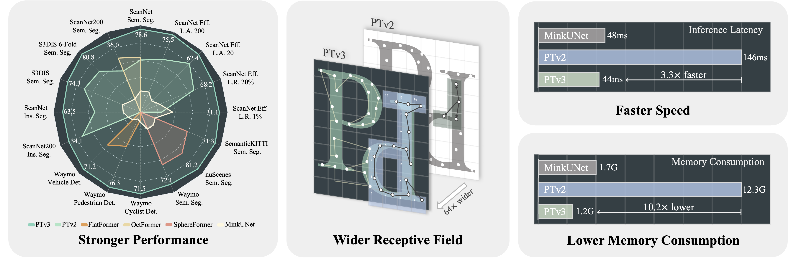

# Point Transformer V3
* _**Graduate student in software engineering - 23 - 2 - 472321733 - libocheng**_
* 仅用来作为《基础软件与开源系统》课程作业
* Only used as homework for the course "Basic Software and Open Source Systems"
<div align='left'>

</div>

## Overview
- [Installation](#installation)
- [Data Preparation](#data-preparation)
- [Quick Start](#quick-start)

## Installation
### Requirements
 PTv3 relies on FlashAttention, while FlashAttention relies on the following requirement, make sure your local Pointcept environment satisfies the requirements:

(Recommendation)
- Ubuntu: 20.04 and above
- CUDA: 11.6 and above
- PyTorch: 1.12.0 and above

### Environment

- Base environment
```bash
conda create -n pointcept python=3.8 -y
conda activate pointcept
conda install ninja -y
conda install pytorch torchvision torchaudio pytorch-cuda=12.1 -c pytorch -c nvidia
conda install h5py pyyaml -c anaconda -y
conda install sharedarray tensorboard tensorboardx yapf addict einops scipy plyfile termcolor timm -c conda-forge -y
conda install pytorch-cluster pytorch-scatter pytorch-sparse -c pyg -y
pip install torch-geometric

cd libs/pointops
python setup.py install
cd ../..
# spconv (SparseUNet)
# refer https://github.com/traveller59/spconv
pip install spconv-cuda
# Open3D (visualization, optional)
pip install open3d
```

- Flash Attention
Following [README](https://github.com/Dao-AILab/flash-attention?tab=readme-ov-file#installation-and-features) in Flash Attention repo and install Flash Attention for PTv3. 

## Data Preparation
Please further refer Pointcept readme [Data Preparation](https://github.com/Pointcept/Pointcept#data-preparation) section.

## Quick Start
```bash
export CUDA_VISIBLE_DEVICES=${CUDA_VISIBLE_DEVICES}
# Script (Recommended)
sh scripts/train.sh -p ${INTERPRETER_PATH} -g ${NUM_GPU} -d ${DATASET_NAME} -c ${CONFIG_NAME} -n ${EXP_NAME}
# Direct
export PYTHONPATH=./
python tools/train.py --config-file ${CONFIG_PATH} --num-gpus ${NUM_GPU} --options save_path=${SAVE_PATH}
```
